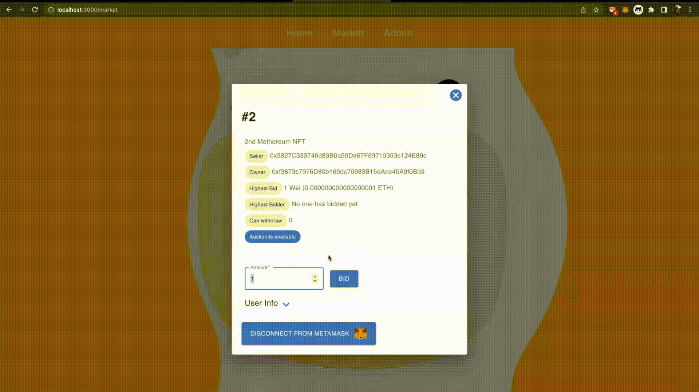

# Methereum

    

  
  Way new online 3D auction market, 'Methereum(Metaverse + Ethereum)' that runs on Ropsten test network.

    

### Landing Page

    

### Market Page

    

## Requirements
- Chrome Browser
- Metamask Chrome Extension

    
